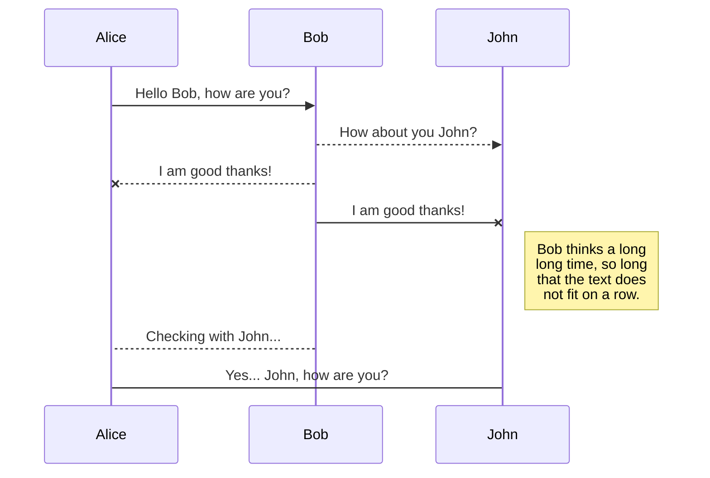
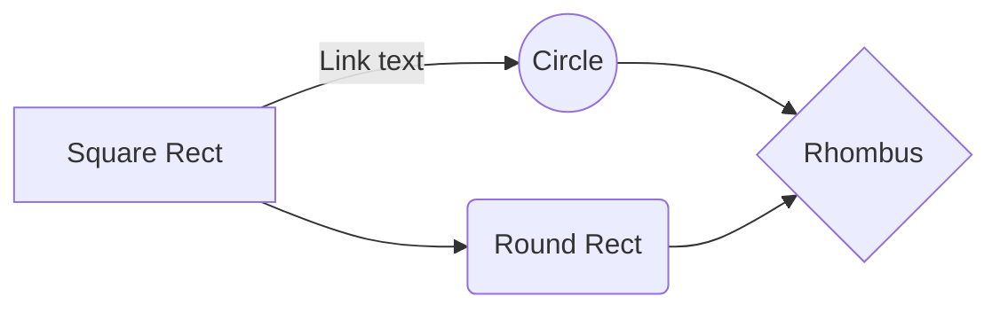

#  DigitalBooking

This project consisted of applying all the tools learned through the Digital House's course: Certified Tech Developer (CTD). For the development stages of this project, the Scrum framework was the backbone guiding the process, where every team member contributed with their strong skills in the areas needed.
This **web application** offers an online reservation service for hotels, apartments, hostels, and  B&B. Through this channel, we connect guests with hosts enabling the guest to reserve any of the mentioned services from anywhere to everywhere around the work at a click distance.

>Este proyecto consistió en aplicar todas las herramientas aprendidas a lo largo del curso Certified Tech Developer (CTD) de Digital House. Para las etapas de desarrollo de este proyecto, fue utilizado Scrum como marco de trabajo y eje central guiando el proceso, donde todos los miembros del equipo contribuyeron con sus habilidades más fuertes en las áreas donde fueron necesitadas.
Esta **aplicación web** ofrece un servicio de reservas online para hoteles, apartamentos, hostels y B&B. Atreves de este canal, conectamos a huéspedes con anfitriones habilitando los huéspedes a reservar en cualquiera de los servicios mencionados, desde y hacia cualquier lugar alrededor del mundo a la distancia de un clic.

## Team
This section will describe the roles performed by every team member and shows their contributions to this project.
>Esta sección describirá los roles desempeñados por cada miembro del equipo y se mostrará sus contribuciones aplicadas en este proyecto.

**Rodrigo Calvo**
Performed design and implementation of AWS network settings. Contributed to database creation and management, and implementation of GitLab CI/CD.
>Realizó diseño e implementación de redes en AWS. Contribuyó en la creación y administración de la base de datos e implementando GitLab CI/CD.

| Role | Contribution |
|--|--|
| Front-end | :white_circle: :white_circle: :white_circle: |
| Back-end | :large_blue_circle: :white_circle: :white_circle: |
| Architecture | :large_blue_circle: :large_blue_circle: :large_blue_circle: |
| Testing / QA | :white_circle: :white_circle: :white_circle: |
| Database | :large_blue_circle: :large_blue_circle: :large_blue_circle: |
**Gaston Innamorato**
Performed design and implementation of React front-end. Contributed to creation of back-end features.
>Realizó diseño e implementación de front-end desarrollado en React. Contribuyó en la creación de funciones del back-end.

| Role | Contribution |
|--|--|
| Fron-end | :large_blue_circle: :large_blue_circle: :large_blue_circle: |
| Back-end | :large_blue_circle: :large_blue_circle: :white_circle: |
| Architecture | :white_circle: :white_circle: :white_circle: |
| Testing / QA | :white_circle: :white_circle: :white_circle: |
| Database | :large_blue_circle: :white_circle: :white_circle: |
**Mónica Muñoz**
Performed design and implementation of React front-end.
>Realizó diseño e implementación de front-end desarrollado en React.

| Role | Contribution |
|--|--|
| Front-end |  :large_blue_circle: :large_blue_circle: :large_blue_circle: |
| Back-end | :white_circle: :white_circle: :white_circle: |
| Architecture | :white_circle: :white_circle: :white_circle: |
| Testing / QA | :white_circle: :white_circle: :white_circle: |
| Database | :white_circle: :white_circle: :white_circle: |
**Jorge Sierra**
Performed design and implementation of back-end, database, GitLab CI/CD, and Dockerizing. Contributed to implementing AWS network settings and back-end testing.
>Realizó diseño e implementación de back-end, base de datos, GitLab CI/CD y dockerizado. Contribuyo a la implementación de configuración de red en AWS y testeo del back-end.

| Role | Contribution |
|--|--|
| Front-end | :white_circle: :white_circle: :white_circle: |
| Back-end | :large_blue_circle: :large_blue_circle: :large_blue_circle: |
| Architecture | :large_blue_circle: :large_blue_circle: :large_blue_circle: |
| Testing / QA | :large_blue_circle: :white_circle: :white_circle: |
| Database | :large_blue_circle: :large_blue_circle: :large_blue_circle: |
**Braian Redmond**
Performed design and implementation of manual and automated testing suites for both front-end and back-end. Reported and documented test results.
>Realizó diseño e implementación de test suites manuales y automatizadas para front-end y back-end. Reporto y documento los resultados de los test realizados.

| Role | Contribution |
|--|--|
| Front-end | :large_blue_circle: :white_circle: :white_circle: |
| Back-end | :large_blue_circle: :white_circle: :white_circle: |
| Architecture | :white_circle: :white_circle: :white_circle: |
| Testing / QA | :large_blue_circle: :large_blue_circle: :large_blue_circle: |
| Database | :white_circle: :white_circle: :white_circle: |
**Víctor Valencia**
Performed design and implementation of back-end and database. Contributed to back-end testing.
>Realizó diseño e implementación de back-end y base de datos. Contribuyo al testeo del back-end.

| Role | Contribution |
|--|--|
| Front End | :white_circle: :white_circle: :white_circle: |
| Back End | :large_blue_circle: :large_blue_circle: :large_blue_circle: |
| Architecture | :white_circle: :white_circle: :white_circle: |
| Testing / QA | :large_blue_circle: :white_circle: :white_circle: |
| Database | :large_blue_circle: :large_blue_circle: :large_blue_circle: |

# Working methodology
At the beginning of the project, we analyzed the requirements, visualized tasks, and identified the comfort areas where each member could develop. We got organized according to recognized strong points where we maximized team productivity.
In the areas where more than one team member was involved, feature progress, challenges, and next steps were discussed in a daily meeting. We agreed to communicate when a branch was modified and pushed to the repository.
In the first sprint, there was no problem with the proposed tasks. As the project progressed, intervention and collaboration of the team in different areas throughout the project became necessary.
At the end of the second sprint, we identified the necessity to schedule team meetings three times a week to evaluate the overall situation of the project.
At the end of each sprint, a meeting was held to review how the team developed, what we should start doing, what we should stop doing, and what actions to take so the teamwork could come to fruition.
The workflow used in GitLab to carry out the project in an organized way is shown in the following diagram, where the backEnd and frontEnd branches have independent pipelines for the integration and continuous deployment of the applications.
>Al comienzo del proyecto, analizamos los requerimientos, visualizamos tareas e identificamos las áreas de confort en que cada miembro podría desenvolverse. Nos organizamos de acuerdo a las fortalezas encontradas en donde maximizábamos la productividad del equipo.
En las áreas donde había mas de una persona involucrada, se hizo una reunión diaria en donde se hablaba los avances, retos y pasos a seguir. Se llegó al acuerdo de comunicar siempre que se modificara una “branch” y se hiciera “push” al repositorio.
En el primer sprint no hubo problemas con el desarrollo de las actividades propuestas. Conforme el proyecto avanzó se hizo necesaria la intervención y colaboración del equipo en distintas áreas a lo largo del proyecto.
Al finalizar el segundo sprint se vio la necesidad de organizar reuniones tres veces por semana donde se reunía todo el equipo para evaluar la situación general del proyecto.
Al finalizar cada sprint, se realizaba una reunión para revisar como se desenvolvió el equipo, que deberíamos empezar a hacer, que deberíamos dejar de hacer y que acciones a tomar para que el trabajo en equipo llegara a buen término.
El flujo de trabajo utilizado en GitLab para llevar el proyecto de manera organizada se muestra en el siguiente diagrama, donde las ramas backEnd y frontEnd cuentan con pipelines independientes para la integración y deploy continuo de las aplicaciones.

# Project logbook
1. First Sprint: This sprint demonstrated the skills of all team members and helped build confidence in each member's capabilities. Where the team works in an organized and collaborative way using daily meetings as a working method. We can summarize this as a successful sprint where a good work environment was generated.
2. Second Sprint: In the sprint retrospective, teamwork and communication were highlighted by all team members. The work methodology was similar to the first sprint. The entire team noted exceptional commitment to delivering an excellent final product. Communication was weaker compared to the first sprint leading to a loss of the general picture of the project and some unfinished tasks.
3. Third Sprint: Due to the lack of communication between areas, task damming happened in this sprint. While handling the carry-over from cloud architecture and CI/CD, back-end endpoints, security, and JWT implementation delayed the front-end development. This situation required extra effort from all team members to arrive at a functional product to display at the end of this sprint.

## Team strengths
## Team improvement opportunities

# Files

StackEdit stores your files in your browser, which means all your files are automatically saved locally and are accessible **offline!**

## Create files and folders

The file explorer is accessible using the button in left corner of the navigation bar. You can create a new file by clicking the **New file** button in the file explorer. You can also create folders by clicking the **New folder** button.

## Switch to another file

All your files and folders are presented as a tree in the file explorer. You can switch from one to another by clicking a file in the tree.

## Rename a file

You can rename the current file by clicking the file name in the navigation bar or by clicking the **Rename** button in the file explorer.

## Delete a file

You can delete the current file by clicking the **Remove** button in the file explorer. The file will be moved into the **Trash** folder and automatically deleted after 7 days of inactivity.

## Export a file

You can export the current file by clicking **Export to disk** in the menu. You can choose to export the file as plain Markdown, as HTML using a Handlebars template or as a PDF.

# Synchronization

Synchronization is one of the biggest features of StackEdit. It enables you to synchronize any file in your workspace with other files stored in your **Google Drive**, your **Dropbox** and your **GitHub** accounts. This allows you to keep writing on other devices, collaborate with people you share the file with, integrate easily into your workflow... The synchronization mechanism takes place every minute in the background, downloading, merging, and uploading file modifications.

There are two types of synchronization and they can complement each other:

- The workspace synchronization will sync all your files, folders and settings automatically. This will allow you to fetch your workspace on any other device.
	> To start syncing your workspace, just sign in with Google in the menu.

- The file synchronization will keep one file of the workspace synced with one or multiple files in **Google Drive**, **Dropbox** or **GitHub**.
	> Before starting to sync files, you must link an account in the **Synchronize** sub-menu.

## Open a file

You can open a file from **Google Drive**, **Dropbox** or **GitHub** by opening the **Synchronize** sub-menu and clicking **Open from**. Once opened in the workspace, any modification in the file will be automatically synced.

## Save a file

You can save any file of the workspace to **Google Drive**, **Dropbox** or **GitHub** by opening the **Synchronize** sub-menu and clicking **Save on**. Even if a file in the workspace is already synced, you can save it to another location. StackEdit can sync one file with multiple locations and accounts.

## Synchronize a file

Once your file is linked to a synchronized location, StackEdit will periodically synchronize it by downloading/uploading any modification. A merge will be performed if necessary and conflicts will be resolved.

If you just have modified your file and you want to force syncing, click the **Synchronize now** button in the navigation bar.

> **Note:** The **Synchronize now** button is disabled if you have no file to synchronize.

## Manage file synchronization

Since one file can be synced with multiple locations, you can list and manage synchronized locations by clicking **File synchronization** in the **Synchronize** sub-menu. This allows you to list and remove synchronized locations that are linked to your file.

# Publication

Publishing in StackEdit makes it simple for you to publish online your files. Once you're happy with a file, you can publish it to different hosting platforms like **Blogger**, **Dropbox**, **Gist**, **GitHub**, **Google Drive**, **WordPress** and **Zendesk**. With [Handlebars templates](http://handlebarsjs.com/), you have full control over what you export.

> Before starting to publish, you must link an account in the **Publish** sub-menu.

## Publish a File

You can publish your file by opening the **Publish** sub-menu and by clicking **Publish to**. For some locations, you can choose between the following formats:

- Markdown: publish the Markdown text on a website that can interpret it (**GitHub** for instance),
- HTML: publish the file converted to HTML via a Handlebars template (on a blog for example).

## Update a publication

After publishing, StackEdit keeps your file linked to that publication which makes it easy for you to re-publish it. Once you have modified your file and you want to update your publication, click on the **Publish now** button in the navigation bar.

> **Note:** The **Publish now** button is disabled if your file has not been published yet.

## Manage file publication

Since one file can be published to multiple locations, you can list and manage publish locations by clicking **File publication** in the **Publish** sub-menu. This allows you to list and remove publication locations that are linked to your file.

# Markdown extensions

StackEdit extends the standard Markdown syntax by adding extra **Markdown extensions**, providing you with some nice features.

> **ProTip:** You can disable any **Markdown extension** in the **File properties** dialog.

## SmartyPants

SmartyPants converts ASCII punctuation characters into "smart" typographic punctuation HTML entities. For example:

|                |ASCII                          |HTML                         |
|----------------|-------------------------------|-----------------------------|
|Single backticks|`'Isn't this fun?'`            |'Isn't this fun?'            |
|Quotes          |`"Isn't this fun?"`            |"Isn't this fun?"            |
|Dashes          |`-- is en-dash, --- is em-dash`|-- is en-dash, --- is em-dash|

## KaTeX

You can render LaTeX mathematical expressions using [KaTeX](https://khan.github.io/KaTeX/):

The *Gamma function* satisfying $\Gamma(n) = (n-1)!\quad\forall n\in\mathbb N$ is via the Euler integral

$$
\Gamma(z) = \int_0^\infty t^{z-1}e^{-t}dt\,.
$$

> You can find more information about **LaTeX** mathematical expressions [here](http://meta.math.stackexchange.com/questions/5020/mathjax-basic-tutorial-and-quick-reference).

## UML diagrams

You can render UML diagrams using [Mermaid](https://mermaidjs.github.io/). For example, this will produce a sequence diagram:

And this will produce a flow chart:

