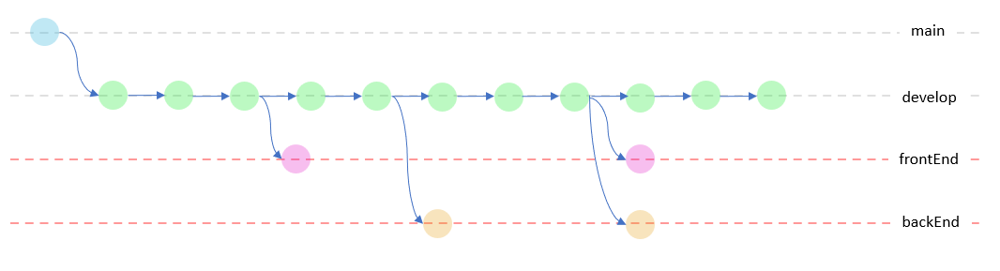
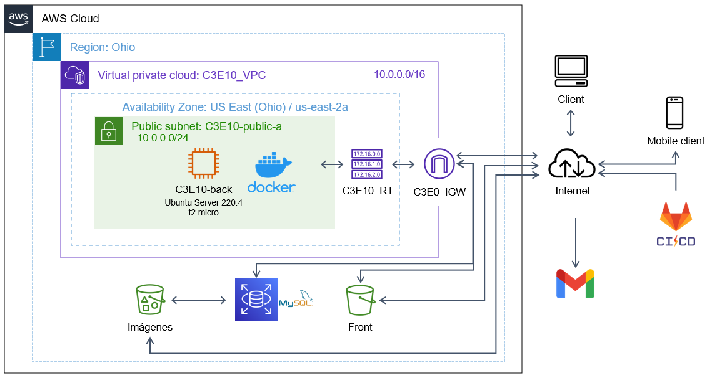
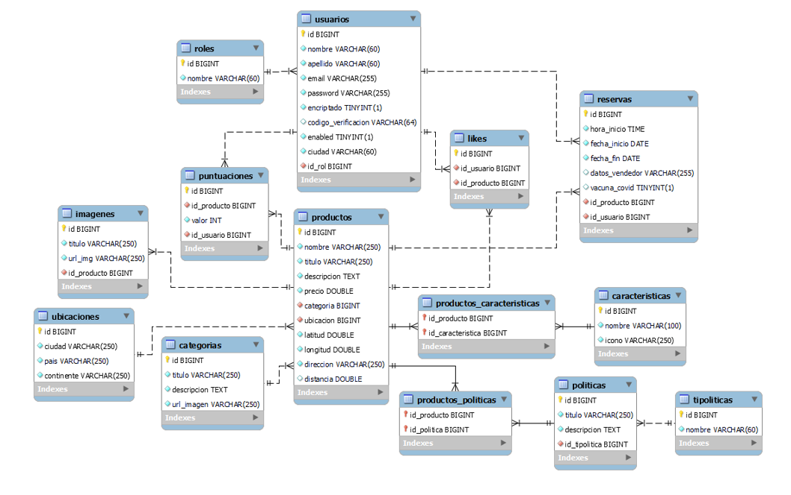

#  DigitalBooking

This project consisted of applying all the tools learned through the Digital House's course: Certified Tech Developer (CTD). For the development stages of this project, the Scrum framework was the backbone guiding the process, where every team member contributed with their strong skills in the areas needed.

This **web application** offers an online reservation service for hotels, apartments, hostels, and  B&B. Through this channel, we connect guests with hosts enabling the guest to reserve any of the mentioned services from anywhere to everywhere around the work at a click distance.

>Este proyecto consistió en aplicar todas las herramientas aprendidas a lo largo del curso Certified Tech Developer (CTD) de Digital House. Para las etapas de desarrollo de este proyecto, fue utilizado Scrum como marco de trabajo y eje central guiando el proceso, donde todos los miembros del equipo contribuyeron con sus habilidades más fuertes en las áreas donde fueron necesitadas. Esta **aplicación web** ofrece un servicio de reservas online para hoteles, apartamentos, hostels y B&B. Atreves de este canal, conectamos a huéspedes con anfitriones habilitando los huéspedes a reservar en cualquiera de los servicios mencionados, desde y hacia cualquier lugar alrededor del mundo a la distancia de un clic.

## Try the app
The application is hosted in a free tier account on AWS. If the links are broken please let us know by reporting an issue.
>La aplicación esta hosteada en una cuenta gratuita de AWS. Si los links estan rotos por favor dejanos saber reportando un issue.

**Front-end app**

**Back-end documentation**

## Team
This section will describe the roles performed by every team member and shows their contributions to this project.
>Esta sección describirá los roles desempeñados por cada miembro del equipo y se mostrará sus contribuciones aplicadas en este proyecto.

**Rodrigo Calvo**

Performed design and implementation of AWS network settings. Contributed to database creation and management, and implementation of GitLab CI/CD.
>Realizó diseño e implementación de redes en AWS. Contribuyó en la creación y administración de la base de datos e implementando GitLab CI/CD.

	
| Role | Contribution |
|--|--|
| Front-end | :white_circle: :white_circle: :white_circle: |
| Back-end | :large_blue_circle: :white_circle: :white_circle: |
| Architecture | :large_blue_circle: :large_blue_circle: :large_blue_circle: |
| Testing / QA | :white_circle: :white_circle: :white_circle: |
| Database | :large_blue_circle: :large_blue_circle: :large_blue_circle: |
	

**Gaston Innamorato**

Performed design and implementation of React front-end. Contributed to creation of back-end features.
>Realizó diseño e implementación de front-end desarrollado en React. Contribuyó en la creación de funciones del back-end.

	
| Role | Contribution |
|--|--|
| Fron-end | :large_blue_circle: :large_blue_circle: :large_blue_circle: |
| Back-end | :large_blue_circle: :large_blue_circle: :white_circle: |
| Architecture | :white_circle: :white_circle: :white_circle: |
| Testing / QA | :white_circle: :white_circle: :white_circle: |
| Database | :large_blue_circle: :white_circle: :white_circle: |
	

**Mónica Muñoz**

Performed design and implementation of React front-end.
>Realizó diseño e implementación de front-end desarrollado en React.

	
| Role | Contribution |
|--|--|
| Front-end |  :large_blue_circle: :large_blue_circle: :large_blue_circle: |
| Back-end | :white_circle: :white_circle: :white_circle: |
| Architecture | :white_circle: :white_circle: :white_circle: |
| Testing / QA | :white_circle: :white_circle: :white_circle: |
| Database | :white_circle: :white_circle: :white_circle: |
	

**Jorge Sierra**

Performed design and implementation of back-end, database, GitLab CI/CD, and Dockerizing. Contributed to implementing AWS network settings and back-end testing.
>Realizó diseño e implementación de back-end, base de datos, GitLab CI/CD y dockerizado. Contribuyo a la implementación de configuración de red en AWS y testeo del back-end.

	
	
| Role | Contribution |
|--|--|
| Front-end | :white_circle: :white_circle: :white_circle: |
| Back-end | :large_blue_circle: :large_blue_circle: :large_blue_circle: |
| Architecture | :large_blue_circle: :large_blue_circle: :large_blue_circle: |
| Testing / QA | :large_blue_circle: :white_circle: :white_circle: |
| Database | :large_blue_circle: :large_blue_circle: :large_blue_circle: |
	

**Braian Redmond**

Performed design and implementation of manual and automated testing suites for both front-end and back-end. Reported and documented test results.
>Realizó diseño e implementación de test suites manuales y automatizadas para front-end y back-end. Reporto y documento los resultados de los test realizados.

	
	
| Role | Contribution |
|--|--|
| Front-end | :large_blue_circle: :white_circle: :white_circle: |
| Back-end | :large_blue_circle: :white_circle: :white_circle: |
| Architecture | :white_circle: :white_circle: :white_circle: |
| Testing / QA | :large_blue_circle: :large_blue_circle: :large_blue_circle: |
| Database | :white_circle: :white_circle: :white_circle: |
	

	
**Víctor Valencia**

Performed design and implementation of back-end and database. Contributed to back-end testing.
>Realizó diseño e implementación de back-end y base de datos. Contribuyo al testeo del back-end.

	
| Role | Contribution |
|--|--|
| Front End | :white_circle: :white_circle: :white_circle: |
| Back End | :large_blue_circle: :large_blue_circle: :large_blue_circle: |
| Architecture | :white_circle: :white_circle: :white_circle: |
| Testing / QA | :large_blue_circle: :white_circle: :white_circle: |
| Database | :large_blue_circle: :large_blue_circle: :large_blue_circle: |
	

	
# Working methodology
At the beginning of the project, we analyzed the requirements, visualized tasks, and identified the comfort areas where each member could develop. We got organized according to recognized strong points where we maximized team productivity.

In the areas where more than one team member was involved, feature progress, challenges, and next steps were discussed in a daily meeting. We agreed to communicate when a branch was modified and pushed to the repository.

In the first sprint, there was no problem with the proposed tasks. As the project progressed, intervention and collaboration of the team in different areas throughout the project became necessary.

At the end of the second sprint, we identified the necessity to schedule team meetings three times a week to evaluate the overall situation of the project.
At the end of each sprint, a meeting was held to review how the team developed, what we should start doing, what we should stop doing, and what actions to take so the teamwork could come to fruition.

The workflow used in GitLab to carry out the project in an organized way is shown in the following diagram, where the backEnd and frontEnd branches have independent pipelines for the integration and continuous deployment of the applications.

>Al comienzo del proyecto, analizamos los requerimientos, visualizamos tareas e identificamos las áreas de confort en que cada miembro podría desenvolverse. Nos organizamos de acuerdo a las fortalezas encontradas en donde maximizábamos la productividad del equipo.
En las áreas donde había mas de una persona involucrada, se hizo una reunión diaria en donde se hablaba los avances, retos y pasos a seguir. Se llegó al acuerdo de comunicar siempre que se modificara una “branch” y se hiciera “push” al repositorio.
En el primer sprint no hubo problemas con el desarrollo de las actividades propuestas. Conforme el proyecto avanzó se hizo necesaria la intervención y colaboración del equipo en distintas áreas a lo largo del proyecto.
Al finalizar el segundo sprint se vio la necesidad de organizar reuniones tres veces por semana donde se reunía todo el equipo para evaluar la situación general del proyecto.
Al finalizar cada sprint, se realizaba una reunión para revisar como se desenvolvió el equipo, que deberíamos empezar a hacer, que deberíamos dejar de hacer y que acciones a tomar para que el trabajo en equipo llegara a buen término.
El flujo de trabajo utilizado en GitLab para llevar el proyecto de manera organizada se muestra en el siguiente diagrama, donde las ramas backEnd y frontEnd cuentan con pipelines independientes para la integración y deploy continuo de las aplicaciones.

# Project logbook
1. First Sprint: This sprint demonstrated the skills of all team members and helped build confidence in each member's capabilities. Where the team works in an organized and collaborative way using daily meetings as a working method. We can summarize this as a successful sprint where a good work environment was generated.
	> Este sprint demostró las habilidades de todos los integrantes del equipo y ayudó a generar confianza en las capacidades de cada miembro. Donde el equipo trabajo de manera organizada y colaborativa utilizando reuniones diarias como método de trabajo. Podemos resumir esté como un sprint exitoso donde se llego a generar un buen clima de trabajo.
2. Second Sprint: In the sprint retrospective, teamwork and communication were highlighted by all team members. The work methodology was similar to the first sprint. The entire team noted exceptional commitment to delivering an excellent final product. Communication was weaker compared to the first sprint leading to a loss of the general picture of the project and some unfinished tasks.
	> En la ceremonia retrospectiva, el trabajo en equipo y la comunicación fueron resaltados por todos los miembros del equipo. La metodología de trabajo en este sprint fue similar a la utilizada en el primer sprint. Todo el equipo notó compromiso excepcional a entregar un excelente producto final. La comunicación en este sprint fue más débil que la presentada en el primer sprint llevado a una perdida de la vista general del proyecto y algunas tareas sin terminar.
3. Third Sprint: Due to the lack of communication between areas, task damming happened in this sprint. While handling the carry-over from cloud architecture and CI/CD, back-end (endpoints, security, and JWT) implementation delayed the front-end development. This situation required extra effort from all team members to arrive at a functional product to display at the end of this sprint.
	> Debido a la falta de comunicación entre áreas, se presento represamiento de tareas en este sprint. Mientras se manejaba el carry-over por parte de la arquitectura de nube y CI/CD, la implementación del back-end (endpoints, security y JWT) retraso el desarrollo del front-end. Esta situación requirió un esfuerzo extra por parte de todo el equipo para llegar con un producto funcional a la presentación del final de este sprint.
4. Forth Sprint: We made it! Despite setbacks from the last sprint, the team worked smartly to fix the bugs and implement all the proposed requirements, including optional ones. Looking back on the work done, every team member expressed pride and satisfaction with the final result.
	> ¡Lo logramos! A pesar de los inconvenientes del sprint pasado, el equipo trabajo de manera inteligente para arreglar los bugs e implementar todos los requerimientos propuestos por el proyecto, incluyendo los opcionales. Mirando en retrospectiva al trabajo realizado, todos los miembros del equipo expresaron orgullo y satisfacción con el producto final.

## Team strengths
One of the team's strengths is the ability to organize quickly and the readiness to attend to these tasks. Responsibility is another, where every team member was focused on finishing the issue it was developing as soon as possible so it could help any other area in need.
>Una de las fortalezas del equipo es la habilidad de organizar rápido y la buena disposición de los miembros del equipo para realizar estas tareas. Responsabilidad es otra, donde cada integrante estuvo enfocado en resolver el desarrollo en que estuviese trabajando lo más rápido posible y así poder ayudar a cualquier otra área que lo necesitara.
## Team improvement opportunities
There was a communication problem during the end of the second and third sprints where the work environment was tense and stressful, and frustration hit the team. Thankfully we could overcome this problem and kept working towards resolving the issues generated by this misunderstanding.
>Hubo un problema de comunicación al final del segundo y tercer sprint donde el ambiente de trabajo fue tenso y estresante, en este momento la frustración golpeó el equipo. Afortunadamente pudimos sobrepasar este problema y continuamos trabajando en resolver los problemas generados por este mal entendido.

# Tech stack
- Project management: GitLab issues and boards.
- Project development:
	- IDEs: Visual Studio Code, IntelliJ IDEA, MySQL Workbench, Selenium IDE.
	- Versioning control: Git and GitLab.
	- Front-end: Vite + React.
	- Back End: Spring Boot, Lombok, OpenApi 3, JWT, Security, SMTP Gmail.
	- Database: MySQL.
	- Cloud achitecture: VPC, S3, RDS, Docker, CI/CD Gitlab.
	- Testing: 
		- Backend: Junit5 y Mockito; 
		- Frontend : React testing library y Jest; API Testing:Postman y Swagger.

# Testing final report
Click on the image to see the report.
>Da clic en la imagen para ver el informe.

	

	

**Report links**
> **Links del informe**
- [Testing DB Sprint 1](src/DBTSprint1.xlsx)
- [POSTMAN COLLECTION](src/db.postman_test_run.json)

# Cloud architecture

	

	

# Database DER

	

	

